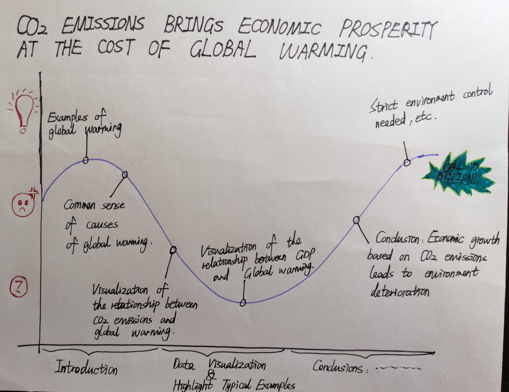

-------------------------------------------------------------------------------------------------------------------------------------------------------------------------------
# The idea (Part I) [This is Part I: Final project](/final_project_I_Yu_Luo.md)

# Outline
## Summary:
I want to find out and visualize the relationship between "CO2 Emissions per Capita of Each Country" and "Global Rise in Temperatures in Each Country", and "CO2 Emissions of Each Country" and ""GDP per Capita of Each Country". The expexted result is CO2 emissions brings economic growth, but causes global warming. 

## Structure:

Firstly, I will show few global warming examples to draw audiences' attention. 
Secondly, I  will briefly introduce causes of global warming. 
Thridly, I will visualize how did CO2 emissions affect global temperature.
Fourthly, I will show the correlation between CO2 emissions and GDP of each country.
Finally, I will give a conclusion and show the anticipated call to action.

# Initial sketches
## C02 Emissions by Country:

## C02 Emissions and Average Temperature by Country:

## C02 Emissions and GDP per Capita by Country:

# The data
## Data sources:
https://www.kaggle.com/catamount11/who-is-resposible-for-global-warming (CO2 Emissions By Country.csv)
https://www.kaggle.com/rishidamarla/global-rise-in-temperatures-in-each-country (Global Land TemperaturesBy Country.csv)
https://www.rug.nl/ggdc/historicaldevelopment/maddison/releases/maddison-project-database-2018 (GDP per Capita By Country.xlsx)

## Plan on using data:
I plan use all 3 data sources listed above. I will extract the data from 1960 to 2014 of variables (Country, Country Code, Year, CO2 Emissions, Average Temperature, GDP per capita) from these 3 files draw plots.

# Method and medium
1. Sort and clean the 3 data sources.
2. Make and write down my own hypotheses.
3. Wireframe a solution, either using pen and paper or Basalmiq (not yet decided).
4. Test the solution with friends and build my solution based on their feedbacks.
5. Use Tableau and Flourish to make data visualizations.
6. Find other materials needed online and organize all materials needed to build my story using Shorthand.
7. Test my Shorthand page with friends and modify.

-------------------------------------------------------------------------------------------------------------------------------------------------------------------------------
# Design and user research (Part II) [This is Part II: Final project](/final_project_II_Yu_Luo.md)

# Development history of my final project
## Change in Theme:
At first, I wanted to analyze the relationship among CO2 emssions, average teperature rise in and GDP per capita of each country worldwidely. However, it was very difficult to find complete and accurate data and was also difficult to present them well with limited time. Hence, I choose to analyze the data from a specific country - China instead.

## Change in Variables:
After finishing 2 planned data visualizations, I realized it would be helpful for targeted policy implementation in China if I can visualize which sectors make the most CO2 emissions. Therefore, I add a variable - CO2 emissions by sector and make a data visualization of proportions of CO2 emissions from different sectors in China.

## New data sources:
1. Carbon dioxide emissions in China from 1960 to 2018: https://www.worldbank.org/
2. GDP in China from 1960 to 2018: https://www.worldbank.org/
3. Annually Average Temperature in China from 1971 to 2014: https://www.worldbank.org/

## New summary of my story:
I want to find out the relationship among "CO2 Emissions" in China and "Annually Average Temperature" in China, and "GDP" in China. I will also analyze proportions of CO2 emissions each sector accounts for to better make practical suggestions. The expexted result is that CO2 emissions brings economic growth, but causes global warming.

# Wireframe

# Storyboard

# Data visualizations
## DataViz 1:

<object class='tableauViz' width='1536' height='677' style='display:none;'><param name='host_url' value='https%3A%2F%2Fprod-useast-a.online.tableau.com%2F' /> <param name='embed_code_version' value='3' /> <param name='site_root' value='&#47;t&#47;yus' /><param name='name' value='FinalProjectDataViz1&#47;Sheet1' /><param name='tabs' value='no' /><param name='toolbar' value='yes' /><param name='showAppBanner' value='false' /></object>

## DataViz 2:

## DataViz 3:

# User research and interviews
## Goals/Questions:

## Taregt audience:

## Interview findings:

## Plan on changing:
I paln to add a few senteces before the 3rd visualization to introduce the reasons of making this visualization and its function. Hopefully, with these explanation, audiences can understand the stroy better and know the purpose after the presentation.

 
-------------------------------------------------------------------------------------------------------------------------------------------------------------------------------
# Final data story (Part III) [This is Part III: Final project](/final_project_III_Yu_Luo.md)
# Audience
My intended audience is the public. There are no specific criteria. Audiences can be people at different age, from different backgounds and have different occupations, etc.
I choose the public as my intended audience because almost every one heard or at least knew a bit about global warming before. It is not a new topic to us but it is an important one. Also, global warming is a severe and urgent problem that we are facing. Every one who lives on this planet are related to and responsible for global warming after all. Therefore, setting the public as intended audience is an ideal choice for this topic.
Since the intend audience is the pulic, the whole content should be understandable by different types of people. Considering different levels of educatoin and professional knowledge they may have, I tried to make all the words, explanations and data visualizations in the final project to be concise, straightforward and intutive. And I use replace some technical terms with accessible descriptions.

# Summary
## Topic:
At first, I chose to visualized the the relationship between "CO2 Emissions per Capita of Each Country" and "Global Rise in Temperatures in Each Country", and "CO2 Emissions of Each Country" and ""GDP per Capita of Each Country" worldwidely. However, I found that it was very difficult to find complete and accurate data and was also difficult to link the results in a logical way as well as present them well with limited time. Hence, I choose to analyze the data from a specific country - China instead. So my final topic is narrowed down to a more focused case - the CO2 emissions, average temperature and GDP in China.

## Story development:
My initial topic did not have a clear story outline. It was just about visualizing the relationship bwtween the 3 variables of each ocuntry in the world. I had no clue about the background and purposes of the story. After changing the topic to a sepcific region, I had a clearer mind. The story starts with an empirical finding in a paper, and then a new exploration of a specific country based on the finding with updated data as well as new varibales goes on. Followingly, data visualizations of the new data of are illustrated. Finally, conclusions ar drwan on the findings shown in the visualizations and actions to be taken are recommended.

## Reflections and things learned:
1. It is not always the more, the better. I chose worldwide data because I thought it would be more convincing and impressive to use such a large database. However, the result turned to be unpleasing - I could not tell a well-organized and appleaing story with such a large database. Focusing on a much smaller database with data of only one country helps me to form a logical story.
2. Feedbacks are important. Receving feedbacksfrom my friends and families on my work is helpful. They would point out confusing places so that I can improve my work.

# Link to my updated Github repository
Here's my updated Github repository: https://yu-luo2.github.io/Yu-94870-portfolio/.

# Link to my story on Shorthand
Here's my story on Shorthand: https://carnegiemellon.shorthandstories.com/--co2-emissions-brings-economic-growth-to-china--at-the-cost-of--global-warming/index.html

-------------------------------------------------------------------------------------------------------------------------------------------------------------------------------
# Links and references
## Paper:
Azomahou, Theophile, Laisney, Francois and Nguyen Van, Phu, (2006), Economic development and CO2 emissions: A nonparametric panel approach, Journal of Public Economics, 90, issue 6-7, p. 1347-1363. https://doi.org/10.1016/j.jpubeco.2005.09.005

## Data sources:
1. Carbon dioxide emissions in China from 1960 to 2018: https://www.worldbank.org/
2. GDP in China from 1960 to 2018: https://www.worldbank.org/
3. Annually Average Temperature in China from 1971 to 2014: https://www.worldbank.org/

## Images:
1. Image downloaded from a news website in a text
Fig.1. Paul, Ridden (2019) IPCC looks to the land in fight against climate change, [painting]. Retrieved October 14, 2020 from the NEW ATLAS website: https://newatlas.com/ipcc-climate-change-land-report/60964/.
2. Image downloaded from Germany's central environmental authority website in a text
Fig.2. Teteline (2018) Greenhouse gas emissions rose again in 2016, [photograph]. Retrieved October 14, 2020 from Umwelt Bundesamt website:  https://www.umweltbundesamt.de/en/press/pressinformation/greenhouse-gas-emissions-rose-again-in-2016
3. Image downloaded from American technology website in a text
Fig.3. Levi, Bianco (2020) The COVID-19 crisis could show us how to cure our congested cities, [photograph]. Retrieved October 14, 2020 from VentureBeaat website:  https://venturebeat.com/2020/03/22/the-covid-19-crisis-could-show-us-how-to-cure-our-congested-cities/
4. Image downloaded from a news website in a text
Fig.4. Brett, Hemmings (2020) Here’s how climate change may make Australia’s wildfires more common, [photograph]. Retrieved October 14, 2020 from ScienceNews website:  https://www.sciencenews.org/article/how-climate-change-may-make-australia-wildfires-more-common
5. Image downloaded from a newspaper website in a text
Fig.5. Paul, Nicklen (2017) No, Global Warming Isn't Killing Off The Polar Bears, [photograph]. Retrieved October 14, 2020 from Investor's Business Daily website:  https://www.investors.com/politics/editorials/no-global-warming-isnt-killing-off-the-polar-bears/
6. Image downloaded from a nonprofit institution website in a text
Fig.6. Climate Change, [photograph]. Retrieved October 14, 2020 from WHOI website:  https://www.whoi.edu/know-your-ocean/ocean-topics/climate-ocean/global-warming/
7. Image downloaded from a nonprofit organization website in a text
Fig.7. Anna, Godeassi (2017) How You Can Help Fight Climate Change, [painting]. Retrieved October 14, 2020 from NRDC website:  https://www.nrdc.org/stories/how-you-can-help-fight-climate-change
8. Image downloaded from a running magazine website in a text
Fig.8. Madeleine, Kelly (2019) What’s the ideal temperature for running? , [painting]. Retrieved October 15, 2020 from Running CANADIAN website:  https://runningmagazine.ca/sections/training/whats-the-ideal-temperature-for-running/
9. Image downloaded from an American news website in a text
Fig.9. David, Roberts (2019) Pulling CO2 out of the air and using it could be a trillion-dollar business, [painting]. Retrieved October 15, 2020 from Vox website: https://www.vox.com/energy-and-environment/2019/9/4/20829431/climate-change-carbon-capture-utilization-sequestration-ccu-ccs
10. Image downloaded from an independent think tank website in a text
Fig.10. Runder, Tisch (2018) Is GDP obsolete? Alternative measures of economic and social progress, [painting]. Retrieved October 15, 2020 from DOC RESEARCH INSTITUTE website: https://doc-research.org/de/our-events/gdp-obsolete-alternative-measures-economic-social-progress/
