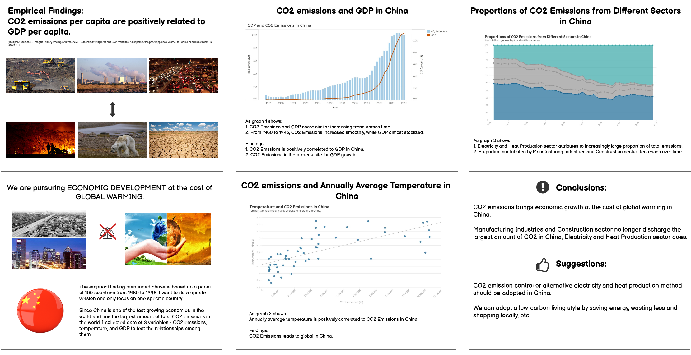
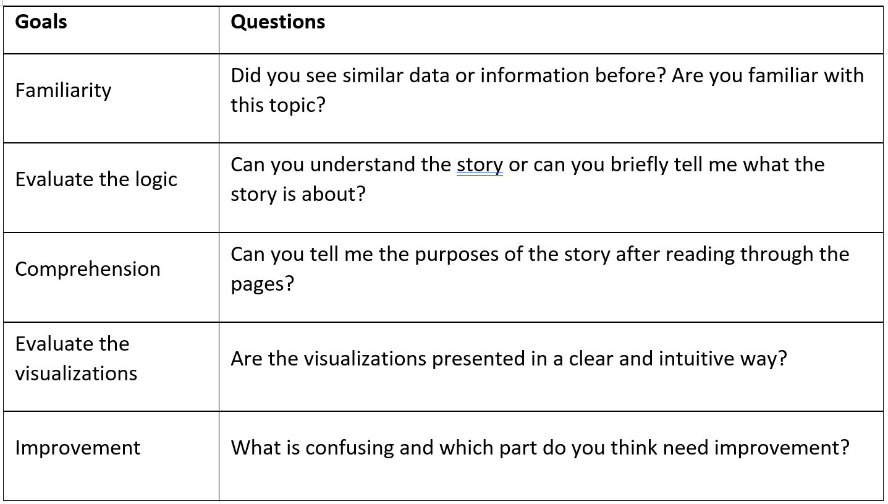
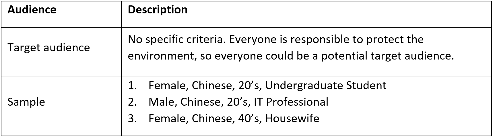

# The idea (Part I) [This is Part I: Final project](/final_project_I_Yu_Luo.md)

# Outline
## Summary:
I want to find out and visualize the relationship between "CO2 Emissions per Capita of Each Country" and "Global Rise in Temperatures in Each Country", and "CO2 Emissions of Each Country" and ""GDP per Capita of Each Country". The expexted result is CO2 emissions brings economic growth, but causes global warming. 

## Structure:

Firstly, I will show few global warming examples to draw audiences' attention. 
Secondly, I  will briefly introduce causes of global warming. 
Thridly, I will visualize how did CO2 emissions affect global temperature.
Fourthly, I will show the correlation between CO2 emissions and GDP of each country.
Finally, I will give a conclusion and show the anticipated call to action.

# Initial sketches
## C02 Emissions by Country:

## C02 Emissions and Average Temperature by Country:

## C02 Emissions and GDP per Capita by Country:

# The data
## Data sources:
https://www.kaggle.com/catamount11/who-is-resposible-for-global-warming (CO2 Emissions By Country.csv)
https://www.kaggle.com/rishidamarla/global-rise-in-temperatures-in-each-country (Global Land TemperaturesBy Country.csv)
https://www.rug.nl/ggdc/historicaldevelopment/maddison/releases/maddison-project-database-2018 (GDP per Capita By Country.xlsx)

## Plan on using data:
I plan use all 3 data sources listed above. I will extract the data from 1960 to 2014 of variables (Country, Country Code, Year, CO2 Emissions, Average Temperature, GDP per capita) from these 3 files draw plots.

# Method and medium
1. Sort and clean the 3 data sources.
2. Make and write down my own hypotheses.
3. Wireframe a solution, either using pen and paper or Basalmiq (not yet decided).
4. Test the solution with friends and build my solution based on their feedbacks.
5. Use Tableau and Flourish to make data visualizations.
6. Find other materials needed online and organize all materials needed to build my story using Shorthand.
7. Test my Shorthand page with friends and modify.

# Design and user research (Part II) [This is Part II: Final project](/final_project_II_Yu_Luo.md)

# Development history of my final project
## Change in Theme:
At first, I wanted to analyze the relationship among CO2 emssions, average teperature rise in and GDP per capita of each country worldwidely. However, it was very difficult to find complete and accurate data and was also difficult to present them well with limited time. Hence, I choose to analyze the data from a specific country - China instead.

## Change in Variables:
After finishing 2 planned data visualizations, I realized it would be helpful for targeted policy implementation in China if I can visualize which sectors make the most CO2 emissions. Therefore, I add a variable - CO2 emissions by sector and make a data visualization of proportions of CO2 emissions from different sectors in China.

## New data sources:
1. Carbon dioxide emissions in China from 1960 to 2018: https://www.worldbank.org/
2. GDP in China from 1960 to 2018: https://www.worldbank.org/
3. Annually Average Temperature in China from 1971 to 2014: https://www.worldbank.org/

## New summary of my story:
I want to find out the relationship among "CO2 Emissions" in China and "Annually Average Temperature" in China, and "GDP" in China. I will also analyze proportions of CO2 emissions each sector accounts for to better make practical suggestions. The expexted result is that CO2 emissions brings economic growth, but causes global warming.

# Wireframe

# Storyboard

# Data visualizations
## DataViz 1:

<object class='tableauViz' width='1536' height='677' style='display:none;'><param name='host_url' value='https%3A%2F%2Fprod-useast-a.online.tableau.com%2F' /> <param name='embed_code_version' value='3' /> <param name='site_root' value='&#47;t&#47;yus' /><param name='name' value='FinalProjectDataViz1&#47;Sheet1' /><param name='tabs' value='no' /><param name='toolbar' value='yes' /><param name='showAppBanner' value='false' /></object>

## DataViz 2:

## DataViz 3:

# User research and interviews
## Goals/Questions:

## Taregt audience:

## Interview findings:

## Plan on changing:
I paln to add a few senteces before the 3rd visualization to introduce the reasons of making this visualization and its function. Hopefully, with these explanation, audiences can understand the stroy better and know the purpose after the presentation.

# Final data story (Part III) [This is Part III: Final project](/final_project_III_Yu_Luo.md)
