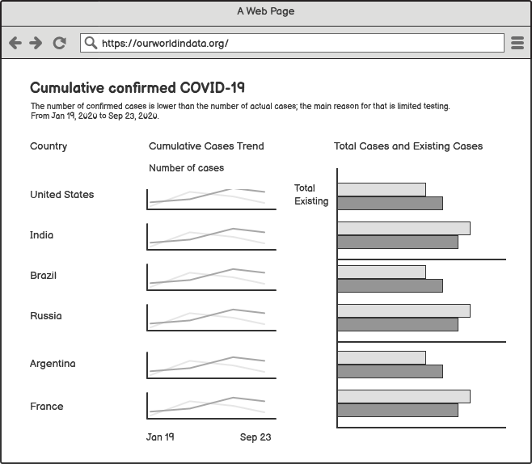

# Step one: find a data visualization
<iframe src="https://ourworldindata.org/coronavirus-data-explorer?zoomToSelection=true&country=&region=World&casesMetric=true&interval=total&aligned=true&hideControls=true&smoothing=0&pickerMetric=location&pickerSort=asc" loading="lazy" style="width: 100%; height: 600px; border: 0px none;"></iframe>

# Step three: wireframe a solution

# Step four: Test the solution
## Friend 1
Q1:
