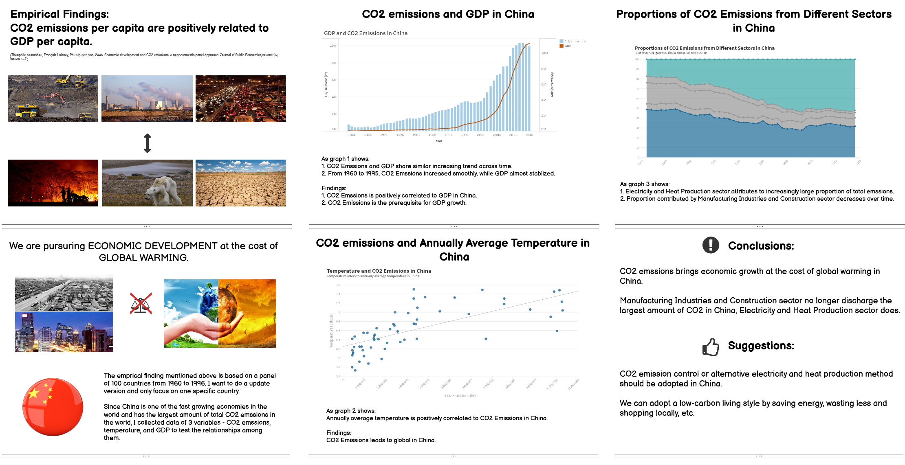
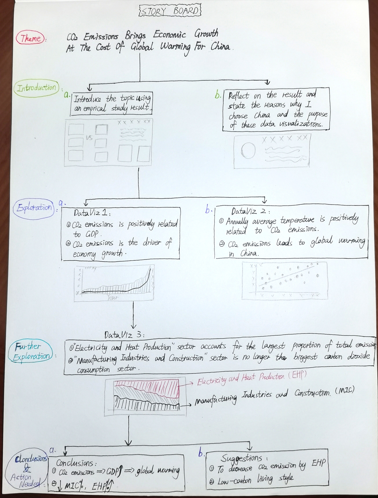
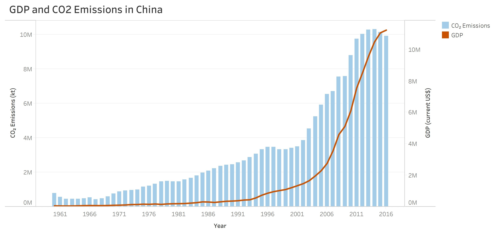
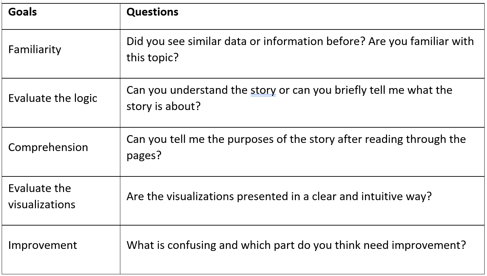
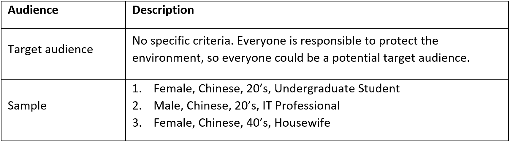
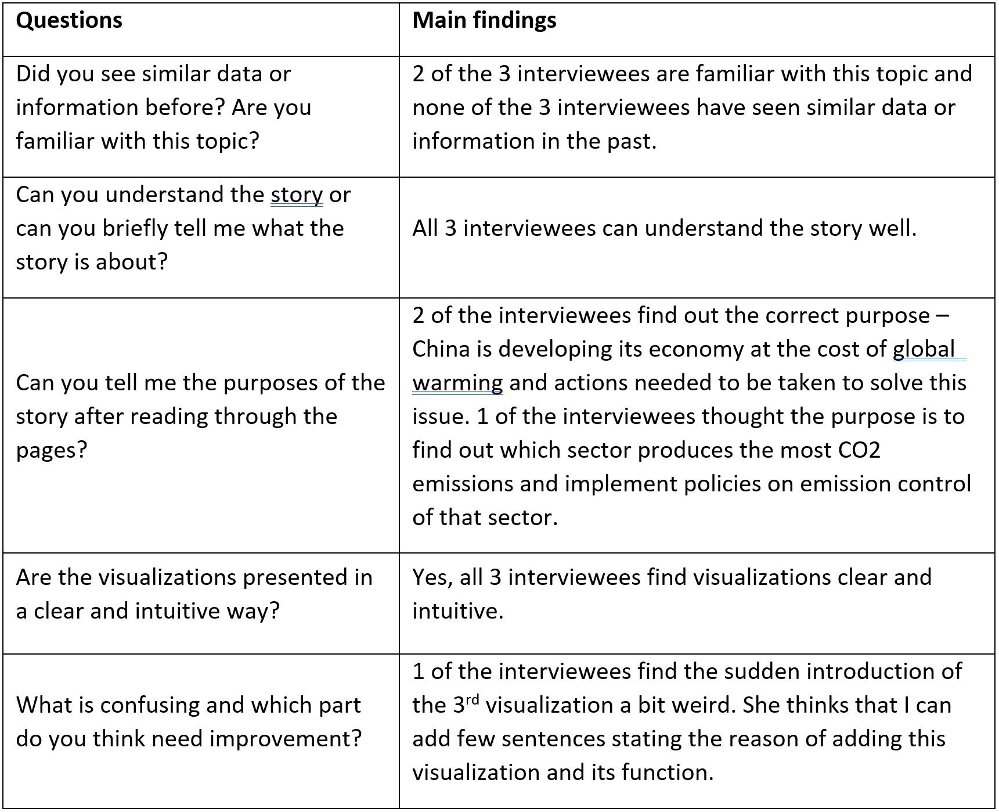

# Development history of my final project
## Change in Theme:
At first, I wanted to analyze the relationship among CO2 emssions, average teperature rise in and GDP per capita of each country worldwidely. However, it was very difficult to find complete and accurate data and was also difficult to present them well with limited time. Hence, I choose to analyze the data from a specific country - China instead.

## Change in Variables:
After finishing 2 planned data visualizations, I realized it would be helpful for targeted policy implementation in China if I can visualize which sectors make the most CO2 emissions. Therefore, I add a variable - CO2 emissions by sector and make a data visualization of proportions of CO2 emissions from different sectors in China.

## New data sources:
1. Carbon dioxide emissions in China from 1960 to 2018: https://www.worldbank.org/
2. GDP in China from 1960 to 2018: https://www.worldbank.org/
3. Annually Average Temperature in China from 1971 to 2014: https://www.worldbank.org/

## New summary of my story:
I want to find out the relationship among "CO2 Emissions" in China and "Annually Average Temperature" in China, and "GDP" in China. I will also analyze proportions of CO2 emissions each sector accounts for to better make practical suggestions. The expexted result is that CO2 emissions brings economic growth, but causes global warming.

# Wireframe

# Storyboard

# Data visualizations
## DataViz 1:
(I couldn't sign in Tableau Online successfully and I've sent IT request to Tableau, so I will put a picture below and update the page by embing the data visualization when the problem is fixed)

## DataViz 2:

## DataViz 3:

# User research and interviews
## Goals/Questions:

## Taregt audience:

## Interview findings:

## Plan on changing:
I paln to add a few senteces before the 3rd visualization to introduce the reasons of making this visualization and its function. Hopefully, with these explanation, audiences can understand the stroy better and know the purpose after the presentation.
