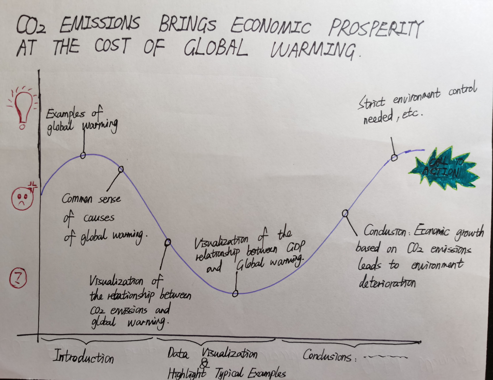

# Github final project page

# Outline
## Summary:
I want to find out and visualize the relationship between "CO2 Emissions per Capita of Each Country" and "Global Rise in Temperatures in Each Country", and "CO2 Emissions of Each Country" and ""GDP per Capita of Each Country". The expexted result is CO2 emissions brings economic growth, but causes global warming. 

## Structure:

Firstly, I will show few global warming examples to draw audiences' attention. 
Secondly, I  will briefly introduce causes of global warming. 
Thridly, I will visualize how did CO2 emissions affect global temperature.
Fourthly, I will show the correlation between CO2 emissions and GDP of each country.
Finally, I will give a conclusion and show the anticipated call to action.

# Initial sketches

# The data
## Data sources:
kaggle datasets download -d catamount11/who-is-resposible-for-global-warming

